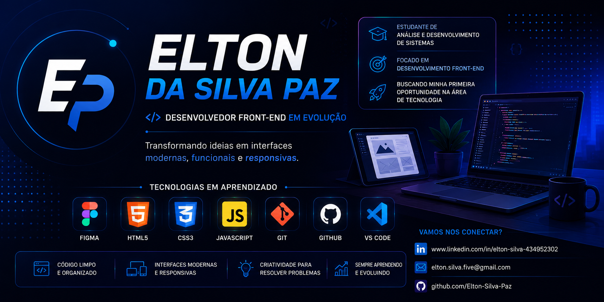

<p align="center">
  
</p>

<p align="center">
  <a href="https://git.io/typing-svg">
    
  </a>
</p>

---

## 🚀 Sobre mim

Estudante de **Análise e Desenvolvimento de Sistemas**, com foco em **Desenvolvimento Front-End**. Estou em constante evolução, construindo uma base técnica sólida e desenvolvendo projetos práticos que transformam ideias em interfaces modernas, funcionais e responsivas.

Busco minha **primeira oportunidade na área de tecnologia** — seja estágio ou vaga júnior — onde eu possa contribuir, aprender e crescer dentro de um time.

- 🎯 Foco atual: Front-End com HTML, CSS e JavaScript
- 📚 Formação: Análise e Desenvolvimento de Sistemas
- 🔍 Disponível para: Estágio e Vaga Júnior
- 📈 Compromisso: Aprendizado contínuo e evolução constante

---

## 🛠️ Tecnologias em Aprendizado

<p align="center">
  <a href="https://skillicons.dev">
    
  </a>
</p>

---

## 📊 GitHub Stats

<p align="center">
  
  
</p>

<p align="center">
  
</p>

---

## 🎯 Objetivos Profissionais

```javascript
const objetivos = {
  curto_prazo:  "Consolidar fundamentos de HTML, CSS e JavaScript",
  medio_prazo:  "Ingressar no mercado como estagiário ou dev júnior",
  longo_prazo:  "Tornar-me um desenvolvedor Front-End completo",
  valores:      ["aprendizado contínuo", "código limpo", "evolução constante"]
};
```

---

## 💼 Projetos em Destaque

<p align="center">
  <a href="https://github.com/Elton-Silva-Paz">
    
  </a>
</p>

> 🔨 Mais projetos em construção — acompanhe a evolução!

---

## 📬 Contato

<p align="center">
  <a href="https://www.linkedin.com/in/elton-silva-434952302" target="_blank">
    
  </a>
  <a href="mailto:elton.silva.five@gmail.com">
    
  </a>
  <a href="https://github.com/Elton-Silva-Paz" target="_blank">
    
  </a>
</p>

---

<p align="center">
  
</p>

---

<p align="center">
  <i>"A jornada de mil milhas começa com um único passo — e eu já dei o primeiro."</i>
</p>
